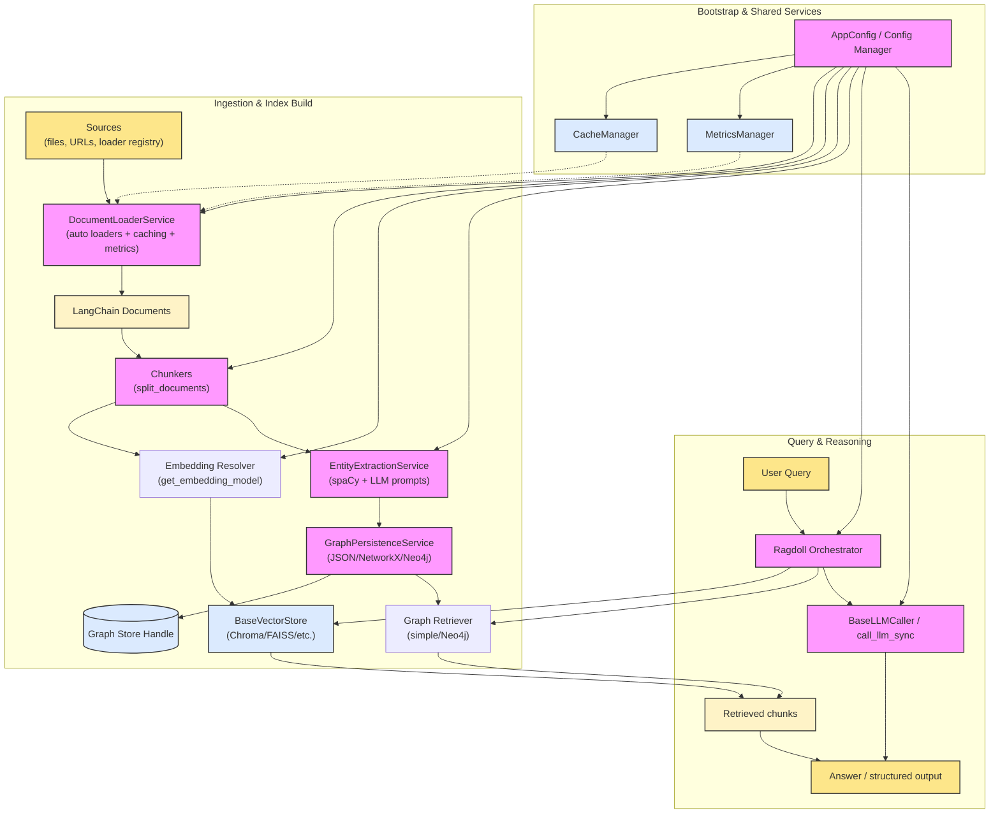

[](https://github.com/nsasto/RAGdoll/actions/workflows/ci.yml)
[](https://github.com/nsasto/RAGdoll/releases)
[](https://pypi.org/project/python-ragdoll/)
[](https://opensource.org/licenses/MIT)

# RAGdoll: A Flexible and Extensible RAG Framework

Welcome to Ragdoll 2.0! This release marks a significant overhaul of the Ragdoll project, focusing on enhanced flexibility, extensibility, and maintainability. We've completely refactored the core architecture to make it easier than ever to adapt Ragdoll to your specific needs and integrate it with the broader LangChain ecosystem. This document outlines the major changes and improvements you'll find in this new version.

# 🧭 Project Overview

RAGdoll 2 is an extensible framework for building Retrieval-Augmented Generation (RAG) applications. It provides a modular architecture that allows you to easily integrate various data sources, chunking strategies, embedding models, vector stores, large language models (LLMs), and graph stores. RAGdoll is designed to be flexible and fast while relying solely on open-source third-party libraries (LangChain, Chroma, spaCy, etc.). It's also designed to accomodate a broad array of file types without any initial dependency on third party hosted services using [langchain-markitdown](https://github.com/nsasto/langchain-markitdown). The loaders can easily be swapped out with any compatible lanchain loader when ready for production.

Note that RAGdoll 2 is a complete overhaul of the initial RAGdoll project and is not backwards compatible in any respect.

## How RAGdoll compares to GraphRAG-style tools

RAGdoll started as a learning project and has grown into a modular orchestrator. I've tried to focus the detail below on what is actually shipped in this repo (no performance claims or benchmarks are published yet) to help position RAGdoll in the broader landscape.

- **Scope:** RAGdoll orchestrates loaders, chunkers, embeddings, vector stores, LLMs, and an optional graph layer. The GraphRAG family (GraphRAG, NanoGraphRAG, Fast GraphRAG) is primarily graph-forward; RAGdoll adds the rest of the RAG plumbing and a demo UI.
- **Graph building:** Entities come from spaCy NER; relations come from prompt-based LLM extraction per chunk (configurable via YAML prompts/parsers). It stores a flat graph (JSON/NetworkX/Neo4j) and exposes a retriever—there is no community detection or hierarchical summarization step.
- **Retrieval:** The default `query` path is vector-only. When you call `ingest_with_graph`, you can also obtain a graph retriever (simple in-memory or Neo4j) and combine it with vector search yourself for hybrid flows; no automatic community summaries are generated. A lightweight hybrid retriever (`query(..., use_hybrid=True)` or `query_hybrid`) now merges vector hits with graph nodes for a fast graph-aware context path.
- **Config and runtime:** Everything is wired through YAML and LangChain abstractions. Defaults point at OpenAI models, but you can swap in local embeddings/LLMs and different stores (Chroma/FAISS/Neo4j) without code changes. Caching and monitoring are built in but optional.
- **Benchmarks:** Cost/speed/quality numbers depend entirely on the models and stores you pick; we have not published comparisons against GraphRAG variants, so avoid quoting figures until you run your own measurements.

## What's New

### Enhanced Features in RAGdoll 2.0

This version of RAGdoll introduces several key features that improve the flexibility and usability of the framework:

- **Caching:** RAGdoll now supports caching, allowing you to store and reuse results from previous operations. This can significantly speed up the execution of your RAG applications by avoiding redundant computations.
- **Auto Loader Selection**: RAGdoll now includes loaders for multiple file types (not only pdf). The loader defaults to Langchain-Markitdown loaders, but can be configured to use any Lanchain compatible loader.
- **Monitoring:** A new monitoring capability has been added to RAGdoll. This allows you to track and understand the performance and behavior of your RAG applications over time.

```yaml
# Enable monitoring in config
monitor:
  enabled: true
```

## Quick Start Guide

Here's a quick example of how to get started with RAGdoll using the new LLM caller abstraction:

```python
from ragdoll.ragdoll import Ragdoll
from ragdoll.llms import get_llm_caller

# Resolve whichever model is marked as default in config (or pass a model name).
llm_caller = get_llm_caller()

# Spin up the orchestrator with sensible defaults.
ragdoll = Ragdoll(llm_caller=llm_caller)

# Ingest a few local files (vector store + caches handled automatically).
ragdoll.ingest_data(["path/to/document.md", "path/to/notes.pdf"])

# Run a retrieval + answer round trip.
result = ragdoll.query("What is the capital of France?")
print(result["answer"])
```

Need finer control over loaders or paths? Use `settings.get_app()` (or `bootstrap_app` with overrides) to obtain the shared `AppConfig`, tweak its `config`, and pass component overrides into `Ragdoll`.

## Demo Application

RAGdoll includes an interactive web-based demo application that showcases its capabilities. The demo provides a user-friendly interface to:

- Configure RAGdoll settings using a YAML editor
- Ingest documents from various sources (files, URLs, text)
- Explore the ingestion pipeline and data transformations
- Query the RAG system and view retrieval traces
- Monitor performance metrics and caching

### Running the Demo

To run the demo application:

```bash
# Ensure dependencies are installed
pip install -e .[all]

# Start the demo server
uvicorn demo_app.main:app --reload
```

Then open your browser to `http://localhost:8000` to access the demo interface.

The demo uses FastAPI for the backend, HTMX and Alpine.js for dynamic interactions, and Tailwind CSS for styling, providing a modern, responsive experience.

### Graph Retrieval Pipeline

When you enable `entity_extraction.graph_retriever.enabled` in your config, you can trigger the full ingestion pipeline (chunking, embeddings, entity extraction, graph persistence) and retrieve a knowledge-graph-aware retriever directly from the `Ragdoll` API:

```python
import asyncio
from ragdoll.ragdoll import Ragdoll
from ragdoll.pipeline import IngestionOptions

async def main():
    ragdoll = Ragdoll()
    result = await ragdoll.ingest_with_graph(
        ["path/to/docs/manual.pdf"],
        options=IngestionOptions(parallel_extraction=False),
    )
    print(result["stats"])           # ingestion metrics
    print(result["graph"])           # pydantic Graph object
    retriever = result["graph_retriever"]
    answers = retriever.invoke("How does the widget fail-safe work?")
    retriever = result["graph_retriever"]
    answers = retriever.invoke("How does the widget fail-safe work?")
    graph_store = result["graph_store"]  # Neo4j/NetworkX/JSON handle if configured

asyncio.run(main())
```

The helper `ingest_with_graph_sync()` wraps `asyncio.run()` for scripts that are not already running an event loop.
See `examples/graph_retriever_example.py` for a complete runnable script.

### How Vector and Graph Stores Work Together

Ragdoll keeps both storage backends under the same orchestration surface:

- `Ragdoll.ingest_data(...)` (or the lower-level `IngestionPipeline`) always loads documents, chunks them, embeds each chunk, and writes those embeddings into the configured **vector store**.
- When `entity_extraction.extract_entities` (or `entity_extraction.graph_retriever.enabled`) is true, the same pipeline also fans out chunks to the **entity extraction service**, which generates a graph, persists it through the configured **graph store**, and can return a graph-aware retriever.
- Both flows are coordinated inside `IngestionPipeline`: it receives the shared `AppConfig`, builds the ingestion service, embedding model, vector store, and optionally graph store, and emits stats/retrievers back through `Ragdoll`.

So even though `ragdoll/vector_stores` and `ragdoll/graph_stores` live in separate packages, their lifecycle is tied together via the pipeline entry points shown above.

## Installation

To install RAGdoll, follow these steps:

### Stable version install

`pip install python-ragdoll`

### Latest version install

1.  **Clone the Repository:**

```bash
    git clone https://github.com/nsasto/RAGdoll.git
    cd RAGdoll
```

2.  **Install Dependencies:**

```bash
    pip install -e .
```

This will install the required dependencies, including Langchain and Pydantic.

### Installation with optional features

RAGdoll supports optional dependency groups for different use cases:

```bash
# Base install (core functionality only)
pip install -e .

# Development tools (testing, linting, formatting)
pip install -e .[dev]

# Entity extraction and NLP features (spaCy, sentence transformers, PDF processing)
pip install -e .[entity]

# Graph database support (Neo4j, RDF)
pip install -e .[graph]

# All optional features combined
pip install -e .[all]
```

### From PyPI (recommended for production)

```bash
# Base install
pip install python-ragdoll

# With optional features
pip install python-ragdoll[all]  # or [dev], [entity], [graph]
```

## Architecture

RAGdoll's architecture is built around modular components and abstract base classes, making it highly extensible. Here's an overview of the key modules:

### Modules

- **`loaders`:** Responsible for loading data from various sources (e.g., directories, JSON files, web pages).
- **`chunkers`:** Handles the splitting of large text documents into smaller chunks.
- **`embeddings`:** Provides an interface for embedding models, allowing you to generate vector representations of text.
- **`vector_stores`:** Manages the storage and retrieval of vector embeddings.
- **`llms`:** Provides an interface to interact with different large language models.
- **`graph_stores`:** Manages the storage and querying of knowledge graphs.
- **`chains`:** Defines different types of chains, like retrieval QA (not implemented)

### Abstract Base Classes

Each module has an abstract base class (`BaseLoader`, `BaseChunker`, `BaseEmbeddings`, `BaseVectorStore`, `BaseGraphStore`, `BaseChain`) or protocol (the `BaseLLMCaller` interface) that defines a standard contract for that component type.

### Default Implementations

RAGdoll provides default implementations for most components, allowing you to quickly get started without having to write everything from scratch:

- **`Langchain-Markitdown`:** A default loader for most major file types.
  See `docs/loader_registry.md` for information on the loader registry and how
  to register custom loader classes under short names.
- **`RecursiveCharacterTextSplitter`:** A default text splitter.
- **`OpenAIEmbeddings`:** Default embeddings that use OpenAI's API.
- **`LangChain VectorStore factory`:** Plug-and-play wrapper for any LangChain vector store (Chroma, FAISS, etc.); see `docs/vector_stores.md`.
- **`OpenAILLM`**: A default OpenAI LLM.
- **`BaseGraphStore`**: A BaseGraphStore, it needs to be implemented.

## Key Design Decisions

RAGdoll 2.0 embraces LangChain's ecosystem for maximum flexibility and maintainability:

### Embeddings: LangChain Embeddings Objects

- **Decision**: Use LangChain `Embeddings` objects directly instead of creating custom embedding classes
- **Rationale**: LangChain provides robust, well-tested embedding implementations. Creating custom wrappers adds unnecessary complexity and maintenance burden.
- **Benefits**: Immediate access to all LangChain embedding providers (OpenAI, HuggingFace, etc.), automatic updates, consistent APIs.
- **Implementation**: `ragdoll.embeddings.get_embedding_model` reads your config and returns a ready-to-use LangChain embedding instance.

### Vector Stores: LangChain VectorStore Interface

- **Decision**: Accept any LangChain `VectorStore` object directly instead of requiring custom adapters
- **Rationale**: LangChain supports 40+ vector stores with consistent interfaces. Custom adapters create maintenance overhead and limit ecosystem integration.
- **Benefits**: Plug-and-play compatibility with any LangChain vector store (Chroma, FAISS, Pinecone, Weaviate, etc.), zero adapter code needed, future-proof with LangChain updates.
- **Implementation**: `BaseVectorStore` wraps LangChain `VectorStore` objects and delegates operations.

This design maximizes ecosystem compatibility while keeping RAGdoll's core orchestration logic clean and focused.

### System Diagram

For a visual walkthrough of how the ingestion, knowledge build, and query-time pieces connect, see the architecture diagram below (also available in `docs/architecture.md`):



## Extensibility

RAGdoll is designed to be highly extensible. You can easily create custom components by following these steps:

1.  **Subclass the Base Class:** Create a new class that inherits from the relevant base class (e.g., `BaseLoader`, `BaseEmbeddings`).
2.  **Implement Abstract Methods:** Implement the abstract methods defined in the base class to provide your custom functionality.
3.  **Integrate into RAGdoll:** Pass an instance of your custom component to the `Ragdoll` class when you create it.

## Configuration

RAGdoll uses Pydantic to manage its configuration. This allows for:

- **Data Validation:** Automatic validation of configuration values.
- **Type Hints:** Clear type definitions for configuration settings.
- **Default Values:** Convenient default values for configuration options.

You can create a `Config` object and pass it to the `Ragdoll` class.

```python
from ragdoll import settings
from ragdoll.ragdoll import Ragdoll

# Grab the shared AppConfig (respects RAGDOLL_CONFIG_PATH when set)
app = settings.get_app()
config = app.config
vector_stores = config._config.setdefault("vector_stores", {})
vector_stores.setdefault("default_store", "chroma")
stores = vector_stores.setdefault("stores", {})
chroma_settings = stores.setdefault("chroma", {})
chroma_settings.setdefault("params", {})["persist_directory"] = "./my_vectors"

# Create Ragdoll with this configuration
ragdoll = Ragdoll(app_config=app)
```

### Entity Extraction Controls

The `entity_extraction` section of `default_config.yaml` now exposes several knobs for graph-centric workflows:

- `relationship_parsing`: choose the preferred output format (`json`, `markdown`, `auto`), optionally supply a custom parser class or schema, and pass parser-specific kwargs. This lets you tighten validation for LLM responses (e.g., point at your own Pydantic schema).
- `relationship_prompts`: declare a default prompt template plus per-provider overrides (e.g., map `"anthropic"` to a Claude-specific prompt). The service picks the prompt whose provider matches the active `BaseLLMCaller`.
- `graph_retriever`: enable creation of a graph retriever after entity extraction, select the backend (`simple` or `neo4j/langchain_neo4j`), and tune parameters like `top_k` or `include_edges`. When enabled, `EntityExtractionService` and `IngestionPipeline` expose a retriever you can plug into downstream chains.

Example excerpt:

```yaml
entity_extraction:
  relationship_parsing:
    preferred_format: "markdown"
    schema: "my_project.schemas.RelationshipListV2"
  relationship_prompts:
    default: "relationship_extraction"
    providers:
      openai: "relationship_extraction_openai"
      anthropic: "relationship_extraction_claude"
  graph_retriever:
    enabled: true
    backend: "neo4j"
    top_k: 10
```

See `docs/configuration.md` for the full field reference.

## Comparison with GraphRAG-style projects

This project began as a learning exercise; use the table below as a rough orientation (not marketing). Descriptions of other tools are based on their public docs - check their repos for specifics.

| Aspect                     | GraphRAG (Microsoft)                                                 | NanoGraphRAG                                                      | Fast GraphRAG                                       | RAGdoll (this repo)                                                                     |
| -------------------------- | -------------------------------------------------------------------- | ----------------------------------------------------------------- | --------------------------------------------------- | --------------------------------------------------------------------------------------- |
| Scope                      | Graph-first pipeline with multi-level community graphs and summaries | Lightweight, graph-centric variants; usually skip heavy hierarchy | Flat graph focus; optimized ingestion and traversal | Full RAG orchestrator (loaders + chunkers + embeddings + LLM + optional graph layer)    |
| Entity/Relation extraction | LLM-heavy entity + relation extraction; extensive prompts            | Simplified or minimal LLM extraction                              | Hybrid/heuristic extraction; typically flat graph   | spaCy NER + prompt-based relationship extraction per chunk; YAML prompt/parser controls |
| Graph structure            | Hierarchical communities + reports                                   | Typically flat or shallow                                         | Flat graph; no hierarchy                            | Flat graph only; persisted to JSON/NetworkX/Neo4j via `GraphPersistenceService`         |
| Summaries                  | Precomputed community summaries                                      | Often none or single-level                                        | Often skipped; sometimes on-demand                  | None precomputed; summaries come from query-time LLM calls if you add them              |
| Retrieval                  | Combines vector + hierarchical graph summaries                       | Lightweight graph or vector                                       | Flat graph traversal; vector when configured        | Vector-first; optional simple/Neo4j graph retriever from `ingest_with_graph`            |
| Defaults                   | Cloud LLMs (GPT-4/O) with hierarchical post-processing               | Small/local-friendly LLMs                                         | Async/flat graph tuned for speed                    | LangChain defaults; OpenAI models by default but fully swappable to local/open-source   |
| Benchmarks                 | Published externally                                                 | Vary by implementation                                            | Vary by implementation                              | None published here—measure with your models/stores                                     |

## Contributing

Contributions to RAGdoll are welcome! To contribute:

1.  Fork the repository.
2.  Create a new branch for your changes.
3.  Make your changes and write tests.
4.  Submit a pull request.

## License

RAGdoll is licensed under the [MIT License](LICENSE).
