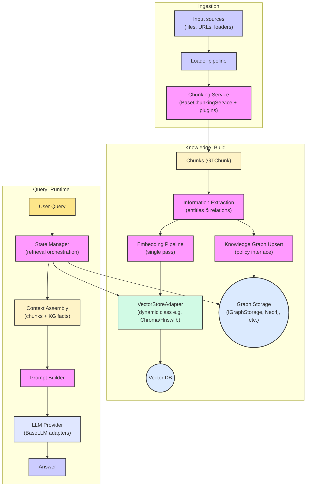

# RAGdoll Architecture Overview

The diagram below shows how ingestion, knowledge construction, and query-time reasoning compose within RAGdoll. Each block corresponds to a pluggable service or adapter, so you can swap in custom implementations as needed.

For deeper dives into each subsystem, see the dedicated docs in `docs/ingestion.md`, `docs/chunking.md`, `docs/embeddings.md`, `docs/vector_stores.md`, `docs/graph_stores.md`, and `docs/llm_integration.md`.
