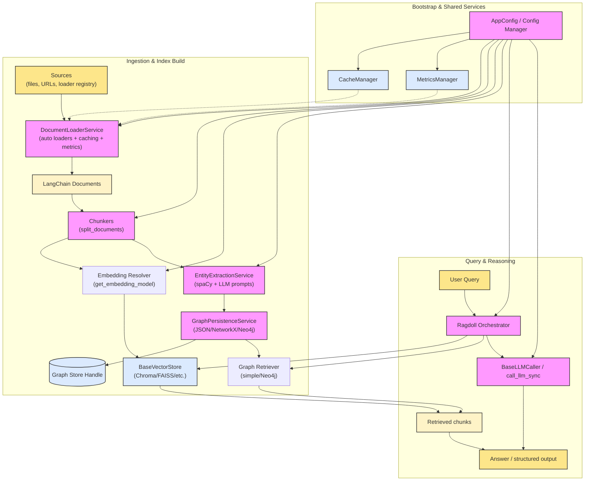

# RAGdoll Architecture Overview

The diagram below shows how ingestion, knowledge construction, and query-time reasoning compose within RAGdoll. Each block corresponds to a pluggable service or adapter, so you can swap in custom implementations as needed.

For deeper dives into each subsystem, see the dedicated docs in `docs/ingestion.md`, `docs/chunking.md`, `docs/embeddings.md`, `docs/vector_stores.md`, `docs/graph_stores.md`, and `docs/llm_integration.md`.
Recent changes worth noting:

- **LLM abstractions** are handled via `BaseLLMCaller`, so LangChain models, custom HTTP clients, or fake callers can be injected consistently. `get_llm_caller()` in `ragdoll.llms` bridges config-driven models into this interface.
- **Graph persistence** lives in `GraphPersistenceService`, which handles JSON/NetworkX/Neo4j output and exposes `create_retriever()` hooks (the new `simple` in-memory retriever and the Neo4j-backed retriever).
- **Hybrid ingestion** is performed by `IngestionPipeline` and surfaced through `Ragdoll.ingest_with_graph()` / `ingest_with_graph_sync()`, giving callers a single entry point for vector + graph indexing and retrieval.
