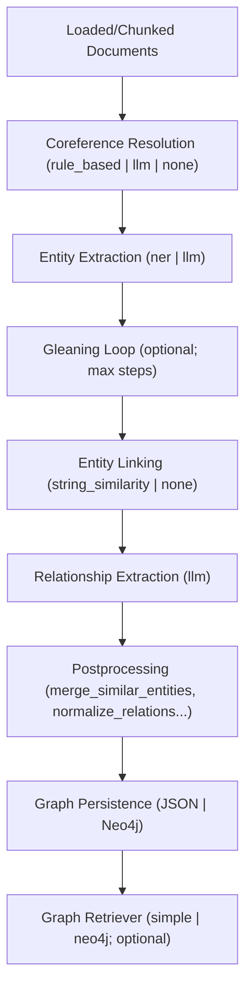

# Entity Extraction & Graph Building

> Location: `ragdoll/entity_extraction/`

RAGdoll converts loaded/chunked documents into a lightweight knowledge graph so you can run graph-aware retrieval or persist the graph for downstream tools.

## High-Level Flow

1. **Chunk (optional)**: `EntityExtractionService.extract()` reuses `chunkers.get_text_splitter` to split long docs if `chunk_documents` is enabled.
2. **Identify entities**: spaCy NER (`_run_spacy`) turns text into `GraphNode` instances (`models.py`).
3. **Infer relationships**: An LLM caller (`_run_relationship_llm`) applies prompt templates (`relationship_prompts`) and parses results via `RelationshipOutputParser`.
4. **Persist & expose**: `GraphPersistenceService` stores the `Graph` (JSON file by default, or Neo4j if configured) and can build a retriever (`simple` in-memory or Neo4j) when enabled.



## Key Components

- `EntityExtractionService` (`entity_extraction_service.py`): Orchestrates chunking, spaCy NER, LLM calls, parsing, and persistence; public entrypoint is `await extract(documents)`.
- `GraphPersistenceService` (`graph_persistence.py`): Saves/loads graphs and creates retrievers.
- `RelationshipOutputParser` (`relationship_parser.py`): Normalizes LLM output into `RelationshipList`.
- Models (`models.py`): `Graph`, `GraphNode`, `GraphEdge`, `RelationshipList`.

## Configuration Knobs

Defined under `entity_extraction` and `graph_database_config` in your app config (`configuration.md`):

### Core Settings

- **`spacy_model`**: spaCy model name (e.g., `en_core_web_sm`).
- **`chunk_documents`**: toggle splitter use; override splitter via `text_splitter`.
- **`chunking_strategy`**: Use `'default'` to use the chunker config, `'none'` to disable chunking, or specify a strategy.
- **`chunk_size`**: Size of text chunks for extraction (default: 1000).
- **`chunk_overlap`**: Overlap between chunks (default: 50).
- **`splitter_type`**: Type of text splitter to use (e.g., `'markdown'`).

### Extraction Method Settings

- **`coreference_resolution_method`**: How to resolve pronominal and nominal coreferences.

  - `rule_based`: Fast heuristic-based rules (default)
  - `llm`: Language model-based resolution (higher quality, slower)
  - `none`: Skip coreference resolution

- **`entity_extraction_methods`**: List of methods for entity extraction (can combine multiple).

  - `ner`: spaCy NER (default)
  - `llm`: Language model-based extraction

- **`relationship_extraction_method`**: How to extract relationships between entities.
  - `llm`: Language model-based extraction (default)

### Gleaning and Linking

- **`gleaning_enabled`**: Enable iterative extraction passes (default: `true`).
- **`max_gleaning_steps`**: Maximum gleaning iterations (default: 2).
- **`entity_linking_enabled`**: Enable entity consolidation (default: `true`).
- **`entity_linking_method`**: Method for linking entities (default: `string_similarity`).
- **`entity_linking_threshold`**: Similarity threshold for linking (default: 0.8).

### Entity and Relationship Types

- **`entity_types`**: List of entity types to extract (e.g., PERSON, ORGANIZATION, etc.).
- **`relationship_types`**: List of relationship types to recognize.
- **`relationship_type_mapping`**: Map natural language phrases to standardized relationship types.

### Postprocessing

- **`postprocessing_steps`**: List of cleanup operations (default: `["merge_similar_entities", "normalize_relations"]`).

### Prompt and Parsing Configuration

- **`relationship_prompts`**: Map providers to prompt template names.

  - `default`: Default prompt template
  - `providers`: Provider-specific overrides (e.g., `openai`, `anthropic`)

- **`relationship_parsing`**: Parser configuration.
  - `preferred_format`: Output format (`json`, `markdown`, `auto`)
  - `parser_class`: Custom parser class path
  - `schema`: Custom Pydantic model
  - `parser_kwargs`: Additional parser arguments

### Graph Storage and Output

- **`output_format`**: Output format (default: `json`).
- **`graph_database_config`**: Graph persistence settings.
  - `output_file`: JSON output path (default: `graph_output.json`)
  - `clear_before_save`: Clear existing graph before save (default: `false`)
  - Neo4j credentials (if using Neo4j backend)

### LLM Provider Hint

- **`llm_provider_hint`**: Manually specify the provider string if auto-detection fails.

### Extraction/Graph-Build Options

The following options control how entities and relationships are extracted from text and how the graph is built. Each option can significantly impact the quality, speed, and coverage of the resulting knowledge graph.

- **`coreference_resolution_method`**: Determines how pronominal and nominal coreferences are resolved before entity extraction. This step clusters mentions of the same entity across the text.

  - `rule_based`: Uses fast, heuristic-based rules to merge pronouns and definite noun phrases (e.g., "Albert Einstein... he") into cohesive entity mentions. This is quick but may miss complex cases.
  - `llm`: Leverages a language model with a dedicated prompt (`prompts/coreference_resolution.md`) to identify and merge coreferent expressions. Higher quality but slower and requires additional LLM calls.
  - `none`: Skips coreference resolution entirely, treating each mention independently. Useful for simple texts or when speed is critical.

- **`entity_extraction_methods`**: Specifies which techniques to use for identifying named entities in the text. Can combine multiple methods for complementary results.

  - `ner` (spaCy NER): Utilizes the configured `spacy_model` (e.g., `en_core_web_sm`) to perform rule-based and statistical named entity recognition. Extracts entities like persons, organizations, dates, and locations efficiently as `GraphNode` instances.
  - `llm`: Supplements or replaces NER with language model-based extraction using prompts from `prompts/entity_extraction.md`. Useful for domain-specific entities that spaCy might miss, but requires more compute.

- **`relationship_extraction_method`**: Controls how relationships between entities are inferred and extracted.

  - `llm`: Uses language models to analyze extracted entities and infer relationships via prompts like `prompts/relationship_extraction.md` or provider-specific variants (e.g., Claude vs OpenAI). The LLM generates structured output that `RelationshipOutputParser` converts into `GraphEdge` instances.

- **`gleaning_enabled`** and **`max_gleaning_steps`**: Enables iterative entity and relationship extraction to improve graph completeness.

  - When `true`, the service performs multiple passes over longer documents or chunks, using the graph built so far as context to discover new entities and relationships that might have been missed initially. `max_gleaning_steps` limits the number of iterations (e.g., 2-3) to prevent infinite loops. This is particularly effective for complex or technical documents where important connections emerge gradually.

- **`entity_linking_enabled`** and related settings: Controls consolidation of similar or identical entities.

  - When enabled, merges near-duplicate entities detected across documents or within long texts. `entity_linking_method` of `string_similarity` uses fuzzy matching with `entity_linking_threshold` (e.g., 0.8) based on Levenshtein distance or similar algorithms to identify entities like "Apple Inc." and "Apple" that should be linked.

- **`postprocessing_steps`**: Defines a sequence of cleanup operations applied after initial extraction and linking to refine the graph.
  - `"merge_similar_entities"`: Applies additional similarity-based merging beyond linking, potentially using embeddings or other metrics.
  - `"normalize_relations"`: Standardizes relationship types and directions (e.g., converting "works for" to "employed_by" and ensuring bidirectional consistency). More steps can be added as custom postprocessors are implemented.

## Usage Patterns

**Direct service**

```python
from ragdoll.entity_extraction import EntityExtractionService

service = EntityExtractionService(app_config=my_app_config)
graph = await service.extract(documents)  # documents: Sequence[langchain_core.documents.Document]
```

**Ingestion pipeline (vector + graph)**

`IngestionPipeline` can run embeddings and entity extraction together; see `docs/ingestion.md` and `examples/graph_retriever_example.py`.

**Demo app**

`/populate_graph` (in `demo_app/main.py`) loads staged docs, calls `EntityExtractionService.extract`, persists via `state.save_graph`, and renders the results in `partials/graph_results.html`.

## Progress & Logging

Set `RAGDOLL_LOG_LEVEL=INFO` (or `DEBUG`) to see per-document extraction progress from `EntityExtractionService` (chunk counts, node/edge deltas, timing). Neo4j operations and retriever creation also log through the same logger namespace.

## Related Docs

- [`graph_stores.md`](graph_stores.md) — persistence backends and retrievers
- [`ingestion.md`](ingestion.md) — how entity extraction is wired into the pipeline
- [`configuration.md`](configuration.md) — full config reference
